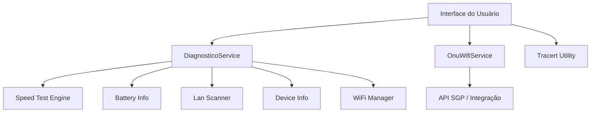

# Sistema de Diagnóstico Completo & Teste de Velocidade

## 🌐 Visão Geral do Ecossistema

Esta documentação abrange o sistema completo de diagnóstico de rede do aplicativo, que vai muito além de um simples teste de velocidade. O sistema é capaz de analisar toda a cadeia de conexão, desde o dispositivo do cliente até a ONU (fibra) e a internet externa.

**Componentes Principais:**
1.  **Speed Test (Frontend):** Interface visual animada para teste de vazão.
2.  **DiagnosticoService (Backend):** Motor central que gerencia estados e executa testes.
3.  **OnuWifiService (Backend):** Integração via API para ler dados da ONU (SGP).
4.  **Tracert (Util):** Ferramenta de análise de rota.

---

## 🏗️ Arquitetura do Módulo



## 📦 Funcionalidades Detalhadas

### 1. Teste de Velocidade (Speed Test)
*Foco visual do Layout 04*
- **Download/Upload:** Vazão em Mbps.
- **Ping/Latência:** Tempo de resposta (ms).
- **Jitter:** Estabilidade da conexão (ms).
- **Gráfico:** Monitoramento em tempo real.
- **Gauge:** Visualização analógica animada.

### 2. Diagnóstico de Rede Local (LAN Scan)
*Disponível no Core, pode ser integrado*
- **Scanner de IP:** Varre a sub-rede (ex: 192.168.1.x).
- **Identificação:** Lista dispositivos conectados na mesma rede.
- **Contagem:** Total de aparelhos consumindo banda.

### 3. Diagnóstico Wi-Fi Avançado
*Disponível no Core*
- **Sinal (RSSI):** Força do sinal em dBm (Excelente, Bom, Ruim).
- **Frequência:** Identifica se é 2.4GHz ou 5GHz.
- **Interferência:** Análise de canais vizinhos (via Android API).
- **Hardware:** BSSID (MAC do rádio) e IP do Gateway.

### 4. Integração com ONU (Fibra)
*Via OnuWifiService*
- **Sinal Óptico (RX/TX):** Potência do sinal da fibra (dBm).
- **Temperatura:** Estado físico do equipamento.
- **Status SGP:** Validação de cadastro e plano na operadora.
- **Autenticação:** Validação de PPPoE.

### 5. Rota e Conectividade (Tracert)
*Módulo shared_traceroute_page.dart*
- **Hops:** Lista cada salto até o destino (ex: 8.8.8.8).
- **Latência por Salto:** Identifica onde está a lentidão.
- **Perda de Pacotes:** Detecta falhas em intermediários.

---

## 🛠️ Implementação Técnica

### Integração com Serviço Principal
```dart
DiagnosticoService _service;
StreamSubscription _subscription;
```

- Conecta ao `DiagnosticoService` para executar testes
- Recebe updates via stream (`stateStream`)
- Estado gerenciado por `DiagnosticoState`

> ⚠️ **Nota Importante:** O `DiagnosticoService` possui capacidades adicionais **NÃO utilizadas** nesta interface visual específica, incluindo:
> - **LAN Scan:** Descoberta de dispositivos na rede local
> - **Wi-Fi Detalhado:** Força do sinal (RSSI), frequência (2.4/5GHz), BSSID, Canal
> - **Info de IP:** Detecção de IPv4 e IPv6 público
> - **Info de Bateria:** Monitoramento de nível (impacta performance WiFi)
> - **Ping Gateway:** Latência específica até o roteador
> 
> Se desejar estas funcionalidades na UI, peça explicitamente para a IA implementá-las usando os métodos existentes no serviço (`_runLanScanTest`, `_runWifiTest`, etc).

### Métodos Principais (UI)

| Método | Descrição |
|--------|-----------|
| `_startTest()` | Inicia teste, reseta gauge e gráfico |
| `_stopTest()` | Para todos os testes em execução |
| `_showHistory()` | Abre modal com histórico de testes |
| `_updateChart()` | Adiciona pontos ao gráfico em tempo real |
| `_extractJitter()` | Extrai valor de jitter dos resultados |

### Estados do Teste

1. **PARADO** - Aguardando início
2. **DOWNLOAD** - Testando velocidade de download
3. **UPLOAD** - Testando velocidade de upload
4. **PRONTO** - Teste concluído

### Animação do Gauge
```dart
AnimationController _gaugeController;
```
- Duração: 1000ms
- Modo: repeat(reverse: true)
- Oscilação visual durante teste

---

## 📜 Histórico de Testes

Modal inferior (`_SpeedHistorySheet`) com resultados anteriores.

### Características:
- Carrega do `speedTestHistoryServiceProvider`
- Lista com separadores
- Cada item mostra:
  - Velocidade de download (destaque)
  - Data/hora formatada
  - Velocidade de upload (secundário)
- Indicador de loading
- Mensagem quando vazio

### Layout do Item:
```
╭──────────────────────────────────╮
│ 🔵  245.8 Mbps          ⬆ 48.2  │
│     12/01/2025 14:30             │
╰──────────────────────────────────╯
```

---

## 🔧 Dependências

```dart
import 'package:fl_chart/fl_chart.dart';
import 'package:google_fonts/google_fonts.dart';
import 'package:flutter_riverpod/flutter_riverpod.dart';
```

- **fl_chart:** Gráficos em tempo real
- **google_fonts:** Tipografia Outfit
- **riverpod:** Gerenciamento de estado

---

## 📱 AppBar

**Título:** "Teste de Velocidade"  
**Estilo:** Transparente, sem elevação

**Ações:**
1. **Cancelar** (vermelho) - Aparece só durante teste
2. **Histórico** - Abre modal de resultados anteriores

---

## 🎯 Fluxo de Uso

```
1. Usuário abre a página
         ↓
2. Vê gauge parado + botão "INICIAR TESTE"
         ↓
3. Toca no botão
         ↓
4. Gauge começa a oscilar
5. Gráfico aparece e cresce
6. Status muda para "DOWNLOAD"
         ↓
7. Download finaliza → Status "UPLOAD"
         ↓
8. Upload finaliza → Status "PRONTO"
9. Gauge para de oscilar
10. Cards mostram resultados finais
         ↓
11. Resultado salvo no histórico
```

---

## 🖼️ Widgets Auxiliares

| Widget | Arquivo | Descrição |
|--------|---------|-----------|
| `GlassCard` | `widgets/glass_card.dart` | Container com efeito glass |
| `SpeedGaugePainter` | Interno | CustomPainter do gauge |
| `_SpeedHistorySheet` | Interno | Modal de histórico |

---

## 🏗️ Arquitetura

```
layout_04/
├── pages/
│   └── speed_test_page.dart  ← Esta página
├── widgets/
│   ├── glass_card.dart       ← Cards glassmorphism
│   ├── bottom_nav.dart       ← Navegação inferior
│   ├── error_widget.dart     ← Tratamento de erros
│   └── skeleton_*.dart       ← Loading states
├── dashboard_page.dart       ← Página principal
├── login_page.dart           ← Tela de login
└── theme.dart                ← Definições de tema
```

---

## 📐 Dimensões

| Elemento | Tamanho |
|----------|---------|
| Gauge | 250 x 250 px |
| Stroke do gauge | 15 px |
| Gráfico altura | 80 px |
| Padding geral | 24 px |
| Botão padding | 48 x 16 px |
| Cards gap | 16 px |

---

## 🔬 Detalhes Técnicos Avançados

### Comportamento ao Voltar (PopScope)
```dart
PopScope(
  canPop: true,
  onPopInvokedWithResult: (didPop, result) {
    if (isRunning) _stopTest();
  }
)
```
- Cancela automaticamente o teste se usuário pressionar voltar durante execução
- Evita testes rodando em background

### Cálculo do Fill do Gauge
```dart
fill = (displaySpeed / 500).clamp(0.0, 1.0)
```
- **Velocidade máxima:** 500 Mbps para normalização
- Valores acima de 500 Mbps completam o gauge (100%)
- Clamp garante valores entre 0-1

### Lógica de Phases (Progress)
```dart
progress = 0.5;   // Download Phase
progress = 1.5;   // Upload Phase  
progress = 2.0;   // Finished
```
- Usado para determinar estado visual do gauge
- Cada fase tem valor específico para controle

### Oscilação do Gauge
```dart
oscillation = _gaugeController.value * 0.1  // 10% de variação
```
- Durante teste, gauge oscila levemente
- Cria ilusão de movimento/atividade
- Combinado com valor real de velocidade

### Limitação de Performance do Gráfico
```dart
if (_spots.length > 50) {
  _spots.removeAt(0);  // Remove ponto mais antigo
}
```
- Mantém apenas 50 pontos mais recentes
- Evita lag em testes longos
- Lista FIFO (First In, First Out)

### Extração Inteligente de Jitter
```dart
_extractJitter(DiagnosticoState state) {
  // Tenta primeiro Google, depois Cloudflare
  result = state.testResultsDisplay['pingGoogle']?['result'];
  if (result == null || !result.contains('Jitter')) {
    result = state.testResultsDisplay['pingCloudflare']?['result'];
  }
  // Parse: "Jitter: 12.5ms" → "12.5ms"
}
```
- Fallback entre múltiplos servidores
- Parse robusto do resultado textual

### Ciclo de Vida do Service
```dart
didChangeDependencies() {
  if (!_serviceInitialized) {
    _service = DiagnosticoService(...);
    _subscription = _service.stateStream.listen(...);
    _serviceInitialized = true;
  }
}
```
- Inicialização tardia do serviço (após context disponível)
- Flag para evitar múltiplas inicializações
- Cleanup no dispose()

### CustomPainter - Shader Gradient
```dart
final gradient = LinearGradient(
  colors: [primaryColor, secondaryColor],
).createShader(Rect.fromCircle(...));

final progressPaint = Paint()..shader = gradient;
```
- Gradiente aplicado via shader (não color simples)
- Permite transições suaves de cor ao longo do arco

### Gráfico sem Interação
```dart
lineTouchData: const LineTouchData(enabled: false)
```
- Toque desabilitado no gráfico
- Foco apenas na visualização, não interação

### Implementação da Leitura de ONU (Exemplo)
```dart
// Inicialização do Serviço
_onuWifiService = OnuWifiService(
  apiUrl: config.apiUrl,
  cpfCnpj: user.cpfCnpj,
  senha: user.senha,
  contrato: user.contratoId,
  sgpParams: {...}
);

// Busca de Sinal
final onuData = await _onuWifiService!.fetchOnuSignal();
print("Sinal RX: ${onuData.signalRx} dBm");
print("Temperatura: ${onuData.temperature} °C");
```
- Requer autenticação do usuário para validar contrato
- Retorna objeto `OnuData` com métricas físicas da fibra

### Chamada para TRACERT (Rota)
```dart
// Navegação para página dedicada
Navigator.push(context, MaterialPageRoute(
  builder: (_) => SharedTraceroutePage()
));
```
- O Tracert é complexo e possui sua própria página dedicada (`SharedTraceroutePage`)
- Executa comando de sistema ou simulação via ICMP

---

## ✨ Diferenciais

1. **Gráfico em tempo real** - Visualização única durante teste
2. **Gauge animado** - Feedback visual atraente
3. **Histórico persistente** - Comparação de resultados
4. **Jitter extraction** - Métrica avançada extraída automaticamente
5. **Feedback háptico** - Experiência tátil premium
6. **Cores dinâmicas** - Adapta ao tema do provedor

---

## 🤖 Como Replicar Esta Funcionalidade com IA

### 📋 Prompt Pronto para Copiar

Cole este prompt em qualquer IA (Claude, ChatGPT, Gemini, etc):

```
Tenho essa documentação completa de uma página de teste de velocidade:

---
[COLE AQUI TODO O CONTEÚDO DESTE ARQUIVO MD - da linha 1 até antes desta seção]
---

Com base nesta documentação técnica, preciso que você crie uma página de teste 
de velocidade em Flutter com as mesmas funcionalidades descritas.

IMPORTANTE:
• Esteja LIVRE para escolher o melhor estilo de design/layout
• Seja CRIATIVO com cores, animações e visual
• Mantenha um design CALMO e profissional
• Todo o código deve estar em UM ÚNICO ARQUIVO .dart

REQUISITOS OBRIGATÓRIOS (da documentação):
✅ Gauge circular animado de 270° com gradient
✅ Gráfico de linha em tempo real (fl_chart)
✅ Cards para Download, Upload, Ping e Jitter
✅ Botão "Iniciar Teste" com animação
✅ Histórico de testes (modal inferior)
✅ Feedback háptico nos botões
✅ Integração com DiagnosticoService via Stream
✅ CustomPainter para o gauge
✅ Limite de 50 pontos no gráfico
✅ PopScope para cancelar ao voltar

REQUISITOS OPCIONAIS (seja criativo):
🎨 Escolha a paleta de cores que achar melhor
🎨 Escolha a fonte Google Fonts que preferir
🎨 Adicione micro-animações extras
🎨 Melhore o visual dos cards
🎨 Adicione transições suaves

ESTRUTURA DO ARQUIVO:
Crie um arquivo único: speed_test_page.dart

Dentro dele:
1. Imports necessários
2. Classe principal SpeedTestPage
3. CustomPainter do Gauge
4. Modal de Histórico
5. Todos widgets auxiliares inline

Por favor, gere o código completo e funcional.
```

### 🎯 Prompt Simplificado (Versão Curta)

Se preferir um prompt mais direto:

```
Leia esta documentação de página de teste de velocidade:

[COLE O ARQUIVO MD AQUI]

Crie uma página Flutter com TODAS as funcionalidades técnicas descritas,
mas com design visual da sua escolha (seja criativo).

Código em arquivo único. Inclua tudo: gauge animado, gráfico tempo real,
cards de métricas, histórico, integração com service via stream.
```

---

### Prompt para Outra IA

Se você quiser que outra IA crie um layout com funcionalidades similares, use este prompt:

```
Preciso que você crie uma página de teste de velocidade de internet em Flutter 
com design moderno e funcionalidades avançadas.

Segue a documentação completa de referência:
[Cole aqui todo o conteúdo deste arquivo MD]

Com base nesta documentação, crie uma nova página de teste de velocidade com:

REQUISITOS VISUAIS:
- Gauge circular animado de 270° com gradiente
- Gráfico de linha em tempo real (usando fl_chart)
- Cards glassmorphism para exibir métricas
- Botão principal com gradiente e sombra
- Tipografia Google Fonts (pode escolher outra fonte)
- Paleta de cores: [especifique suas cores, ex: #6B7FD7 primary, #4FD1C5 secondary]

REQUISITOS FUNCIONAIS:
- Teste de Download e Upload em Mbps
- Exibição de Ping (latência) e Jitter
- Animação oscilante durante teste
- Gráfico atualizado em tempo real (limitar 50 pontos)
- Histórico de testes com persistência local
- Botão cancelar durante teste
- PopScope para cancelar ao voltar
- Feedback háptico nos botões

REQUISITOS TÉCNICOS:
- Usar Riverpod para gerenciamento de estado
- Integrar com DiagnosticoService (já existe no projeto)
- CustomPainter para o gauge com shader gradient
- StreamSubscription para updates em tempo real
- Gauge normalizado para 500 Mbps máximo

ESTRUTURA DE ARQUIVOS:
- Arquivo principal: lib/layouts/[seu_layout]/pages/speed_test_page.dart
- Widget auxiliar: lib/layouts/[seu_layout]/widgets/glass_card.dart
- Seguir padrão de arquitetura do resto do projeto

Por favor, gere o código completo e funcional.
```

### Variações de Prompt

**Para mudança de estilo visual:**
```
Crie a mesma funcionalidade da documentação, mas com estilo [escolha]:
- Neumorphic (como Layout 03)
- Cyberpunk com neon
- Minimalista material design
- Dark mode com glassmorphism
- Gradientes vibrantes anos 80
```

**Para funcionalidades específicas:**
```
Do arquivo de documentação, implemente APENAS:
- O gauge animado com CustomPainter
- O gráfico de tempo real
- Os cards de métricas (sem histórico)
```

**Para modificações:**
```
Com base na documentação, crie a página MAS:
- Troque o gauge por um speedometer estilo carro
- Use chart de barras ao invés de linha
- Adicione teste de latência para múltiplos servidores
- Salve histórico no Firebase ao invés de local
```

### Dica Importante

Sempre **anexe este arquivo completo** no prompt. A documentação tem:
- ✅ Diagramas ASCII dos componentes visuais
- ✅ Código de exemplo para partes críticas
- ✅ Dimensões exatas
- ✅ Fluxo de uso passo a passo
- ✅ Detalhes técnicos avançados

Quanto mais específico você for sobre o que quer DIFERENTE, melhor será o resultado!
